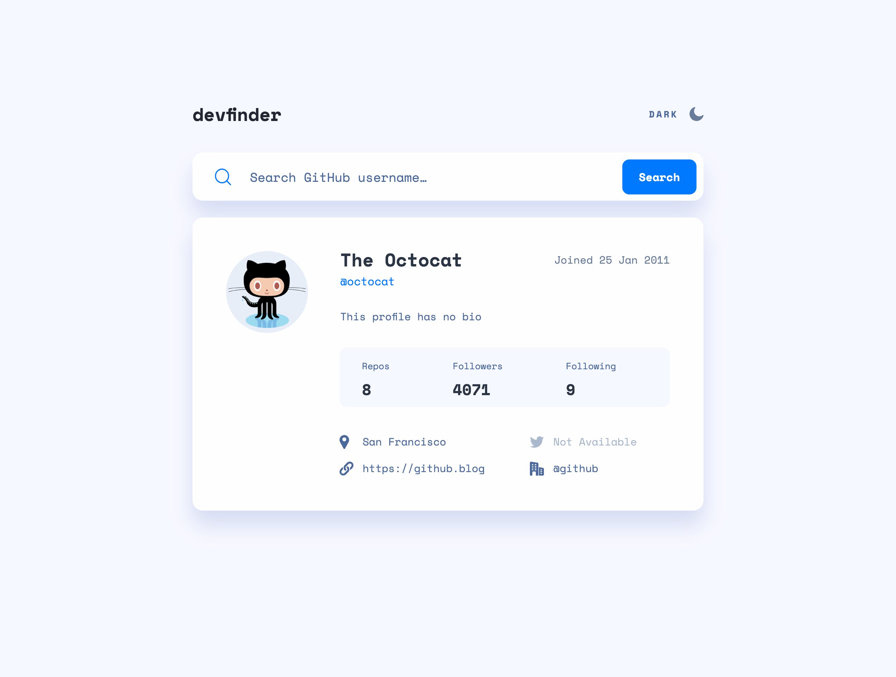
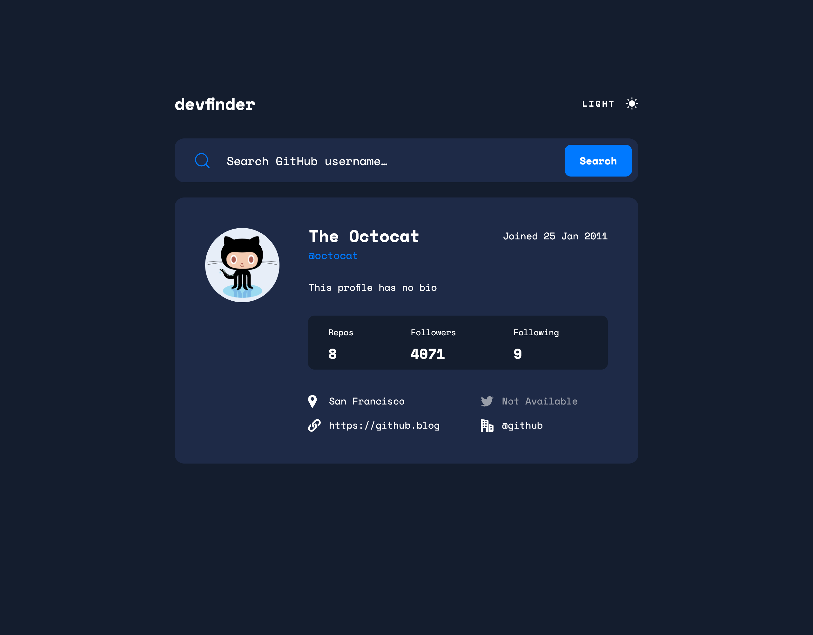
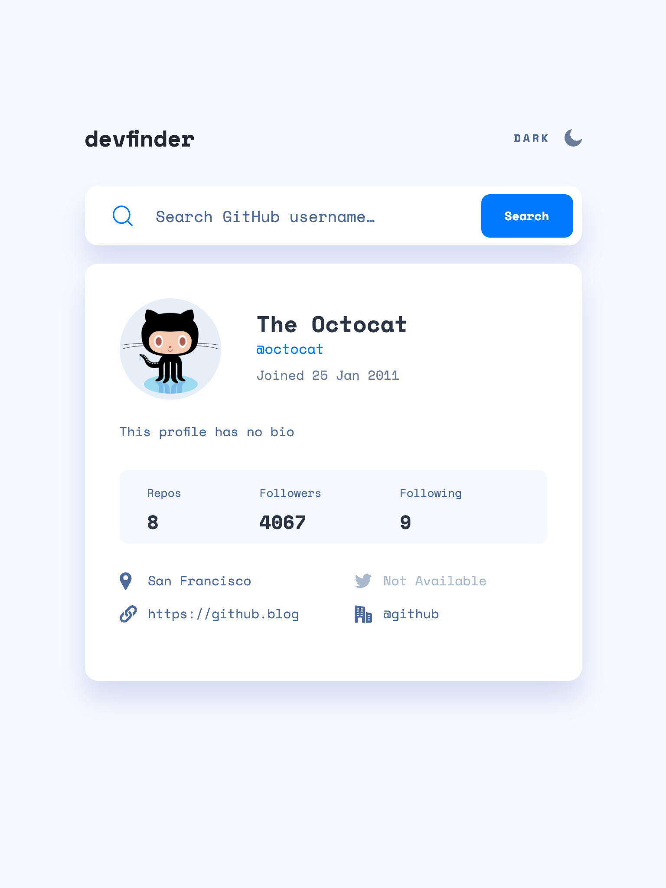
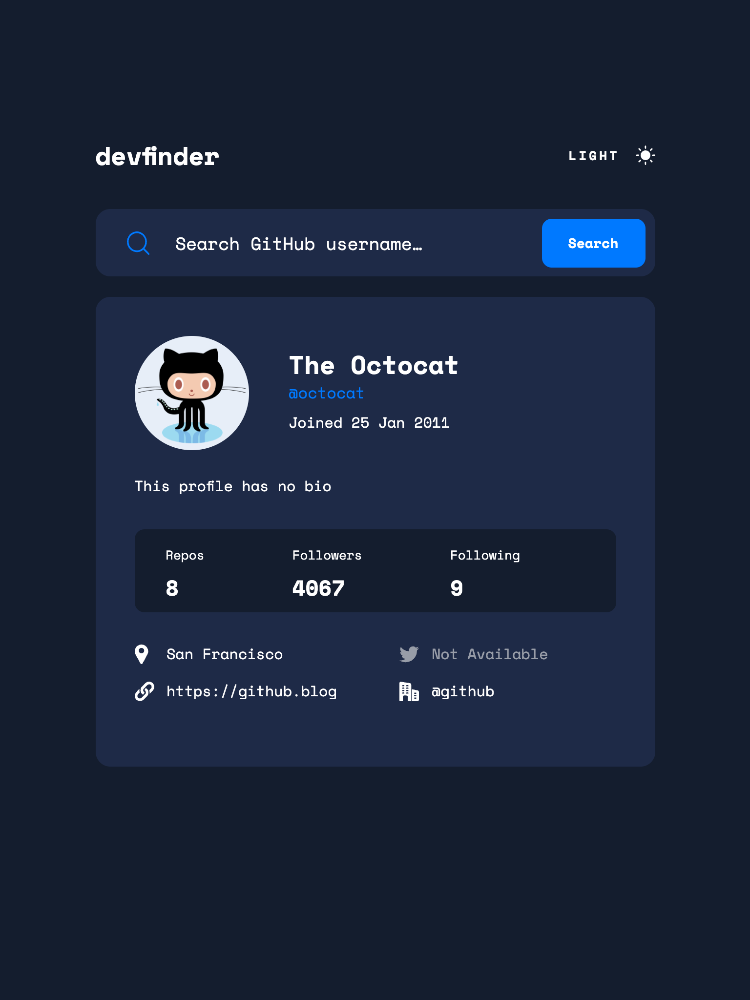
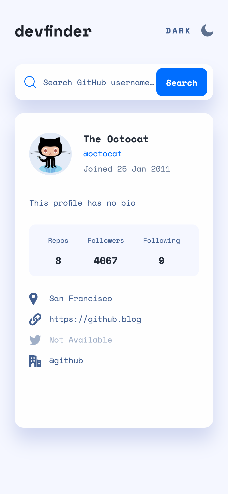
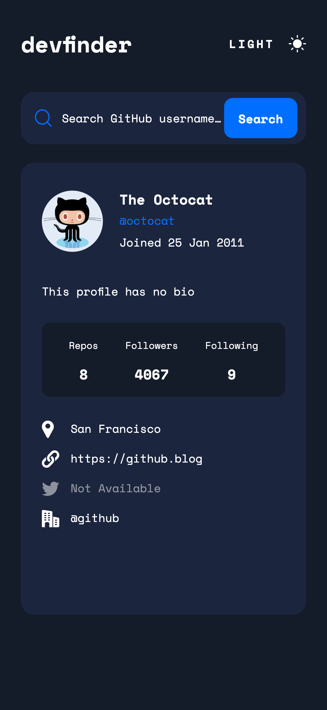

# GitHub user search app

Challenge by [Frontend Mentor](https://www.frontendmentor.io?ref=challenge). Coded by Erwin Ruiz.

## Table of contents

- [Overview](#overview)
  - [The challenge](#the-challenge)
  - [Link](#link)
  - [Built with](#built-with)
  - [Layout](#layout)
  - [Screenshots](#screenshots)

## Overview

### The challenge

Users should be able to:

- View the optimal layout for the app depending on their device's screen size
- See hover states for all interactive elements on the page
- Search for GitHub users by their username
- See relevant user information based on their search
- Switch between light and dark themes
- Have the correct color scheme chosen for them based on their computer preferences.

### Link

- Live Site URL: [Click here](https://erwinruiz.github.io/github-user-search-app/)

### Built with

- Semantic HTML5 markup
- CSS custom properties
- Flexbox
- CSS Grid
- Mobile-first workflow
- TypeScript
- [React](https://reactjs.org/) - JS library
- Context
- CSS Modules
- GitHub users API

### Layout

The designs were created to the following widths:

- Mobile: 375px
- Tablet: 768px
- Desktop: 1024px

### Screenshots

- [Desktop](#desktop)
- [Tablet](#tablet)
- [Mobile](#mobile)

#### Desktop

#### Tablet

#### Mobile

